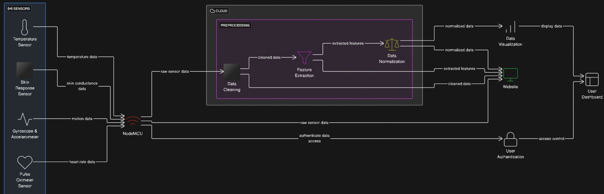
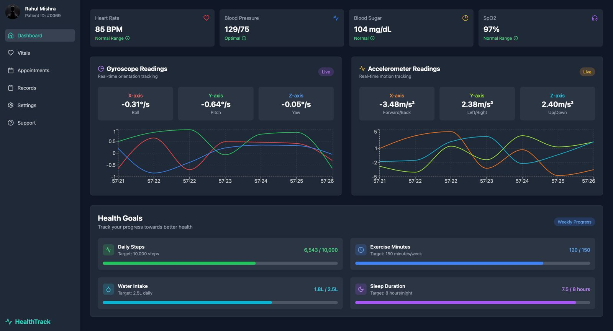
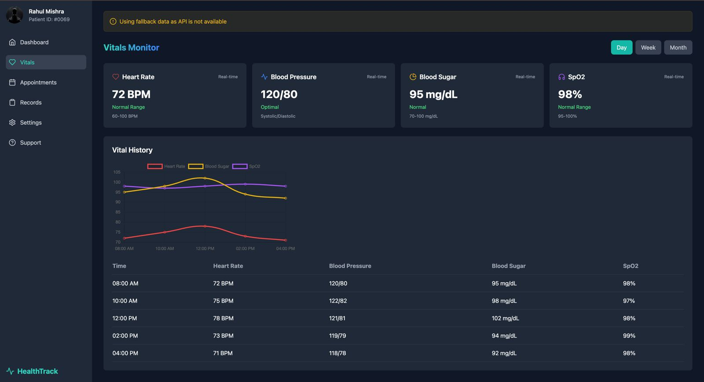
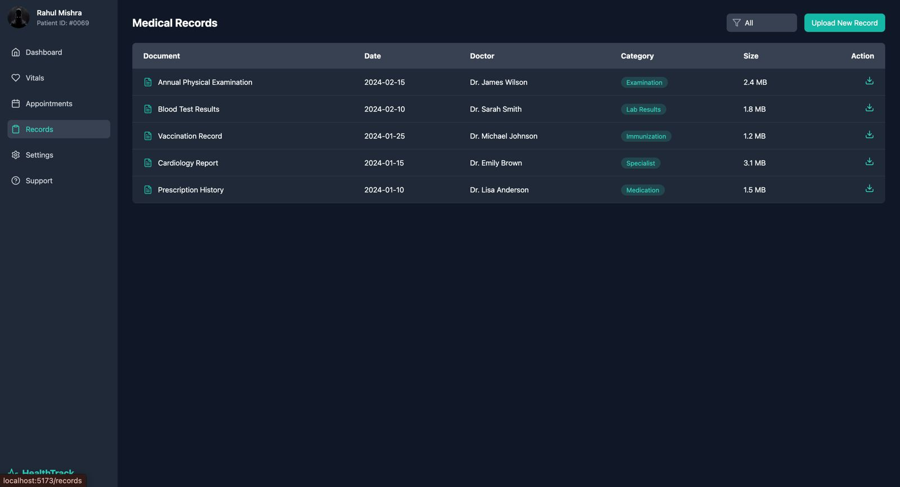
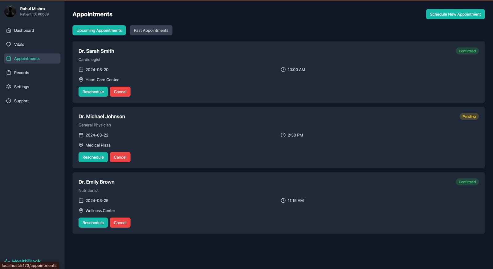
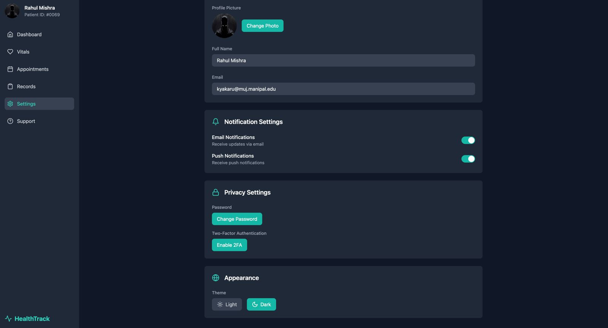
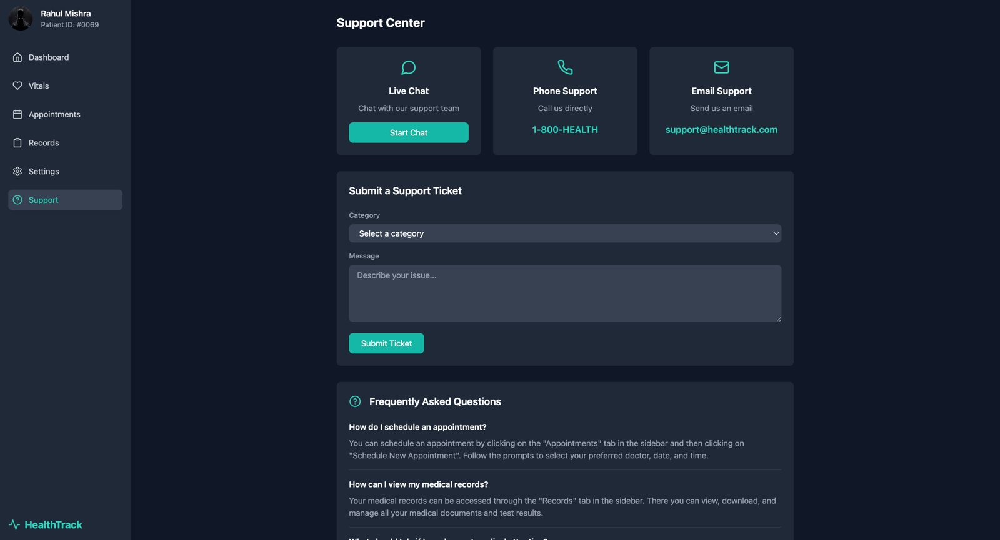

# Health Monitoring System

A comprehensive health monitoring system using NodeMCU ESP8266 that collects various health metrics including heart rate, blood oxygen, temperature, blood pressure, blood sugar, activity tracking, and sleep quality.




## Components

### Hardware Requirements
- NodeMCU ESP8266
- MAX30100 Pulse Oximeter
- Adafruit MLX90614 Infrared Temperature Sensor
- Adafruit ADS1115 ADC (for blood pressure and sugar measurements)
- Power supply (5V)
- Connecting wires

### Software Requirements
- Arduino IDE
- Required Libraries:
  - ESP8266WiFi
  - Wire
  - ArduinoJson
  - MAX30100_PulseOximeter
  - Adafruit_MLX90614
  - Adafruit_ADS1X15

## Features

1. **Heart Rate Monitoring**
   - Real-time heart rate measurement
   - Beat detection and tracking

2. **Blood Oxygen (SpO2)**
   - Continuous oxygen saturation monitoring
   - Accurate readings through MAX30100 sensor

3. **Temperature Monitoring**
   - Non-contact temperature measurement
   - Uses MLX90614 infrared sensor

4. **Blood Pressure**
   - Systolic and diastolic pressure monitoring
   - Simulated readings (requires proper BP sensor for production)

5. **Blood Sugar**
   - Glucose level monitoring
   - Simulated readings (requires proper glucose sensor for production)

6. **Activity Tracking**
   - Step counting
   - Calorie calculation
   - Distance tracking

7. **Sleep Quality Monitoring**
   - Sleep quality assessment
   - Duration tracking

## User Interface

### Dashboard


The dashboard provides a comprehensive overview of all health metrics in real-time.

### Vital Signs


Monitor your vital signs including heart rate, blood pressure, and temperature.

### Records


View historical data and track your health progress over time.

### Appointments


Schedule and manage your medical appointments.

### Settings


Configure system settings and preferences.

### Support


Access help and support resources.

## Setup Instructions

1. **Hardware Setup**
   - Connect the MAX30100 sensor to the NodeMCU
   - Connect the MLX90614 sensor to the I2C pins
   - Connect the ADS1115 to the I2C pins
   - Ensure proper power supply to all components

2. **Software Setup**
   - Install Arduino IDE
   - Install required libraries
   - Configure WiFi credentials in the code:
     ```cpp
     const char* ssid = "YOUR_WIFI_SSID";
     const char* password = "YOUR_WIFI_PASSWORD";
     ```
   - Upload the code to NodeMCU

## Data Format

The system outputs JSON data with the following structure:

```json
{
  "deviceId": "NODEMCU_001",
  "heartRate": 75,
  "spo2": 98,
  "temperature": 36.5,
  "bloodPressure": {
    "systolic": 120,
    "diastolic": 80
  },
  "bloodSugar": 100,
  "activity": {
    "steps": 1000,
    "calories": 40,
    "distance": 0.762
  },
  "sleep": {
    "quality": 85,
    "duration": 0
  }
}
```

## Usage

1. Power on the device
2. Wait for WiFi connection (indicated by serial output)
3. The device will automatically start collecting and transmitting data every 5 seconds
4. Monitor the serial output for health metrics

## Important Notes

- Some measurements (blood pressure, blood sugar, steps, sleep quality) are currently simulated and require proper sensors for production use
- Ensure proper calibration of sensors before use
- Maintain appropriate distance for temperature measurements
- Keep the device in a stable environment for accurate readings

## Safety Considerations

- This is a prototype system and should not be used for medical diagnosis
- Always consult healthcare professionals for medical advice
- Ensure proper sanitization of sensors between uses
- Keep the device away from water and extreme temperatures

## Troubleshooting

1. **WiFi Connection Issues**
   - Check WiFi credentials
   - Ensure proper signal strength
   - Verify network availability

2. **Sensor Reading Issues**
   - Check sensor connections
   - Verify power supply
   - Ensure proper sensor placement

3. **Data Transmission Issues**
   - Check serial output
   - Verify JSON formatting
   - Ensure proper baud rate (115200)

## Future Improvements

- Integration with cloud services
- Mobile app development
- Real-time alerts and notifications
- Historical data analysis
- Machine learning for health predictions
- Integration with medical databases

## License

This project is open-source and available under the MIT License.

